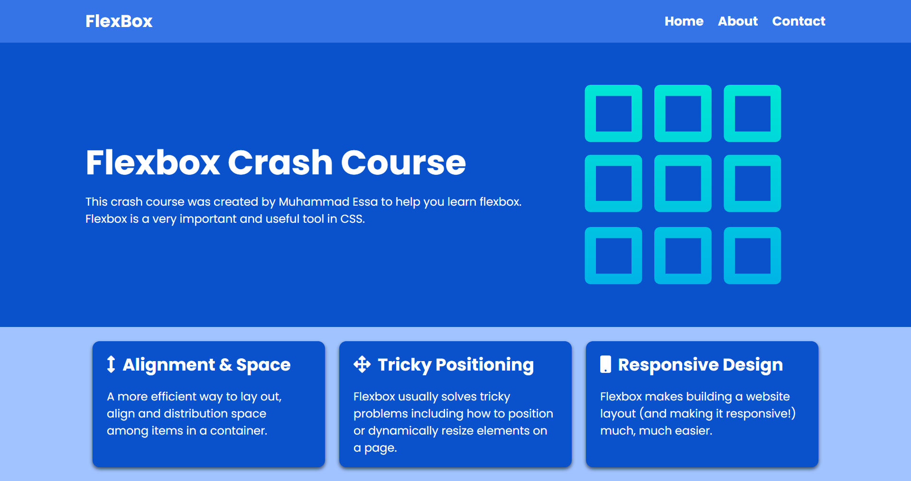

# Flexbox-Crash-Course
> All about css flex-box
---
#### Learned about CSS Flexbox
- CSS3
- FLEXBOX
- FLEX ( ROW - COLUMN )
- FLEX-DIRECTIONS
- FLEX-BASES
- FLEX-GROW
- FLEX-SHRINK
- FLEX-WRAP

> Here is the project I designed using `FLEXBOX`

## Link :
> https://imuhammadessa.github.io/Flexbox-crash-course/ 

